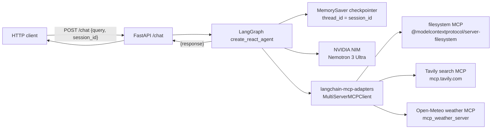
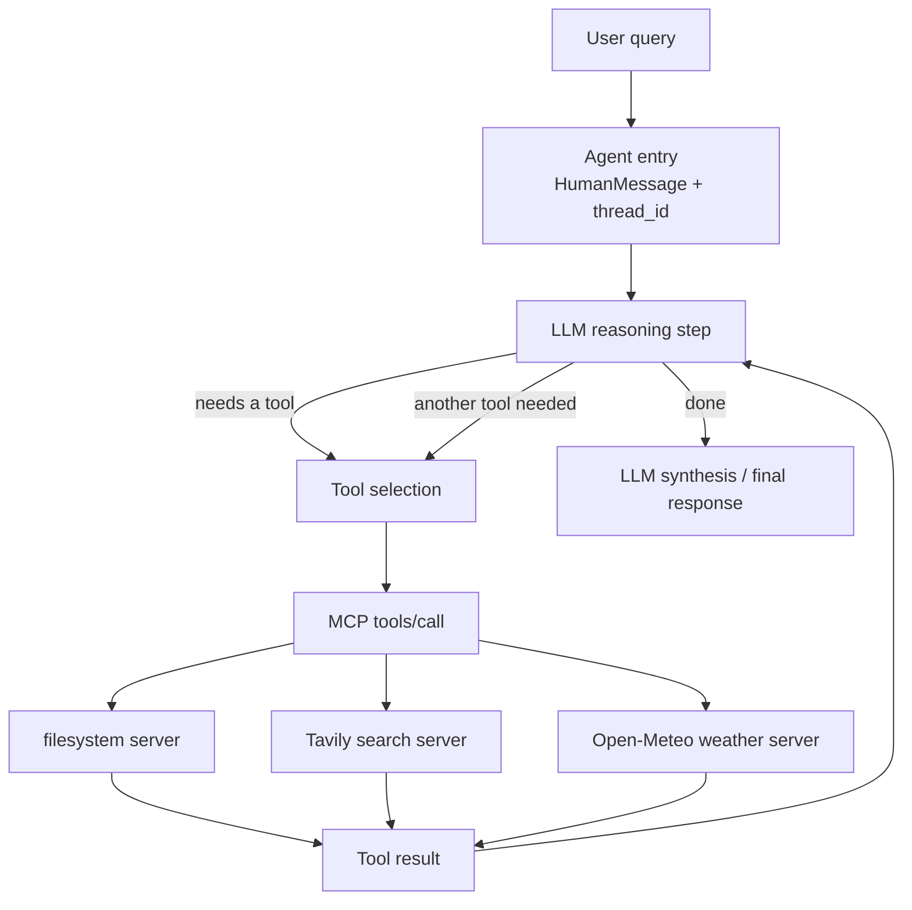
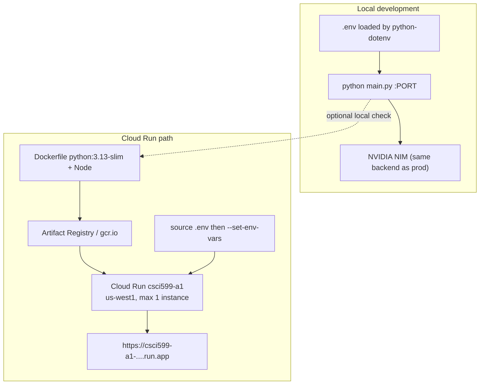

# CSCI 599 Assignment 1 — Tool-using LangGraph agent

FastAPI service that hosts a LangGraph ReAct agent. The agent discovers and
calls tools on three real MCP servers, remembers the conversation with a
LangGraph `MemorySaver` keyed by `session_id`, and deploys to Cloud Run.

## Setup

Python 3.13+ and Node.js 18+ (for `@modelcontextprotocol/server-filesystem`).

```bash
python3 -m venv .venv
source .venv/bin/activate
pip install -r requirements.txt
cp .env.example .env
```

Fill `.env` with your NVIDIA NIM key (`NVIDIA_API_KEY` or `OPENAI_API_KEY`)
and Tavily key. Do not commit `.env`.

## Run locally

```bash
source .venv/bin/activate
python main.py
```

```bash
curl -s http://localhost:8080/health
curl -s -X POST http://localhost:8080/chat \
  -H 'Content-Type: application/json' \
  -d '{"query":"hello","session_id":"demo"}'
```

Try a two-turn memory check with the same `session_id`, then ask
`What did I ask you last?`

Tests (API contract, dead MCP servers, tool errors, non-string tool results):

```bash
python -m pytest -q tests
```

## Deploy

```bash
./deploy.sh
```

The script sources `.env` and passes keys to Cloud Run with `--set-env-vars`.
Region: `us-west1`. Project: `csci-599-agenticai`. Leave the service running
(`--min-instances 0`) until grades are posted.

Live URL: https://csci599-a1-881242810047.us-west1.run.app

## Cost

- Cloud Run: scale-to-zero, 512Mi, max 1 instance. Course note from CSCI 571:
  nobody used more than ~$10 of the $50 education credit.
- NVIDIA NIM developer key: free tier, ~40 req/min.
- Tavily: free/student tier for grading runs.
- Open-Meteo and filesystem MCP: $0.

## MCP servers

| Server | Package | Why |
|---|---|---|
| filesystem | [`@modelcontextprotocol/server-filesystem`](https://www.npmjs.com/package/@modelcontextprotocol/server-filesystem) | Canonical file tools. Root is `workspace/` locally and `/app/workspace` on Cloud Run. |
| Tavily search | [Tavily remote MCP](https://github.com/tavily-ai/tavily-mcp) | Canonical web search. Official `tools/list` + `tools/call` over Streamable HTTP. |
| Open-Meteo weather | [`mcp_weather_server`](https://github.com/jkeam/mcp_weather_server) | Extra server. Weather is a question search answers badly (stale snippets), while Open-Meteo returns live structured data. Free, no key, and it adds a second stdio server (Python) next to the Node filesystem one. |

All three are reached through `langchain-mcp-adapters` (`MultiServerMCPClient`).
Tool results are not hard-coded.

If one server is down at startup, the others still load. Tool crashes come back
as error strings so the agent can keep talking.

## LLM

NVIDIA NIM, OpenAI-compatible endpoint
`https://integrate.api.nvidia.com/v1`, model
`nvidia/nemotron-3-ultra-550b-a55b` (assignment-tested Nemotron 3 Ultra).
Override with `OPENAI_MODEL`. I started on Nemotron 3.5 Lightning, but on
follow-up turns it often wrote a fake `[ERROR: Tool ... failed]` reply instead
of calling the tool; Ultra got 4/4 on the same test.

## Architecture

### 1. System architecture



### 2. Tool invocation loop



The loop-back arrow is required: after a tool result the model reasons again
and may call another tool instead of answering.

### 3. Deployment topology



## API

`POST /chat`

```json
{"query": "string", "session_id": "string"}
```

```json
{"response": "string"}
```

`GET /health` lists which MCP servers answered `tools/list`.
